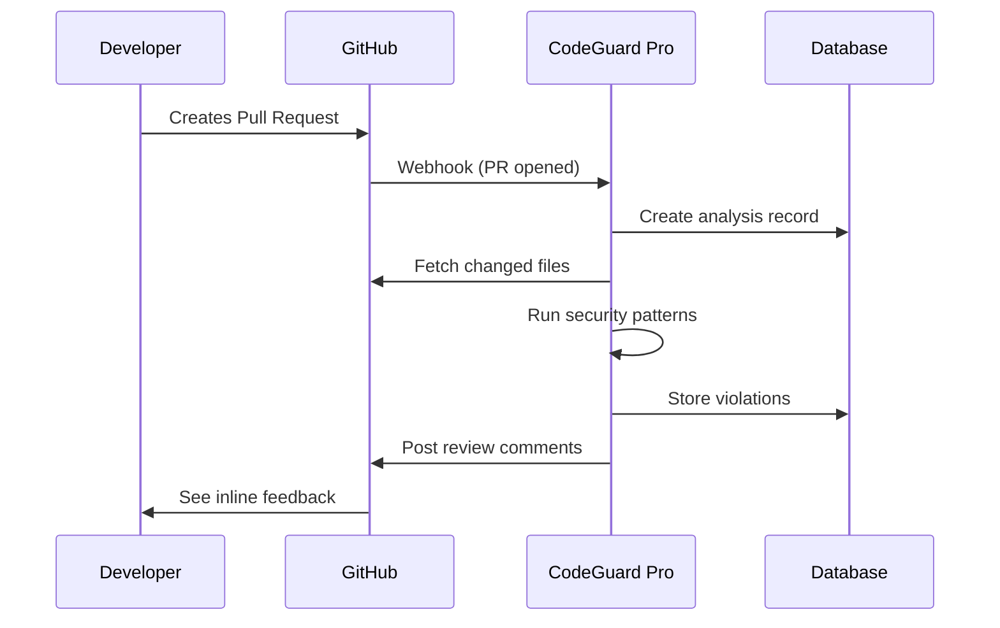

<p align="center">
  
  
  
  
</p>

# 🛡️ CodeGuard Pro

> **Automated Code Compliance & Security Analysis Platform for GitHub Pull Requests**

CodeGuard Pro is a full-stack **GitHub App** that automatically scans pull requests for security vulnerabilities and code compliance issues, providing real-time feedback directly on PRs through inline comments.

---

## 📋 Table of Contents

- [Problem Statement](#-problem-statement)
- [Solution](#-solution)
- [Key Features](#-key-features)
- [System Architecture](#-system-architecture)
- [Tech Stack](#-tech-stack)
- [Project Structure](#-project-structure)
- [Installation](#-installation)
- [How It Works](#-how-it-works)
- [API Endpoints](#-api-endpoints)
- [Future Enhancements](#-future-enhancements)

---

## 🎯 Problem Statement

Modern development teams face critical challenges:

- **Security vulnerabilities** slip through code reviews unnoticed
- **Hardcoded secrets** (API keys, passwords) accidentally get committed
- **Manual code reviews** are time-consuming and inconsistent
- **Compliance standards** are difficult to enforce across large teams

---

## 💡 Solution

CodeGuard Pro provides an **automated, real-time security analysis pipeline** that:

✅ Integrates seamlessly with GitHub via webhooks  
✅ Analyzes every pull request automatically  
✅ Detects security issues across multiple programming languages  
✅ Posts actionable feedback directly on the PR  
✅ Tracks compliance history through a web dashboard  

---

## ✨ Key Features

### 🔗 GitHub App Integration
- Receives webhooks on PR `opened`, `synchronize`, and `reopened` events
- Posts inline review comments on specific lines with violations
- Falls back to summary comments for better visibility

### 🌐 Multi-Language Support
- **JavaScript / TypeScript** - Node.js, React, Next.js projects
- **Python** - Django, Flask, FastAPI applications
- **Java** - Spring Boot, Maven projects
- Support for additional languages via extensible rule engine

### 🔍 Security Violation Detection
| Category | Detection |
|----------|-----------|
| **Secrets** | Hardcoded API keys, passwords, tokens, credentials |
| **Cryptography** | Weak algorithms (MD5, SHA1), insecure random |
| **Injection** | eval(), exec(), document.write() usage |
| **Configuration** | SSL verification disabled, insecure settings |
| **Python-Specific** | Pickle deserialization vulnerabilities |

### 📊 Web Dashboard
- **Projects View** - Manage connected repositories
- **Rules Management** - Create, edit, and toggle compliance rules
- **Analysis History** - Track all PR scans with detailed results
- **Rule Templates** - Pre-built security rule sets

### 🔐 Authentication & Security
- GitHub OAuth integration via NextAuth.js
- Webhook signature verification (HMAC-SHA256)
- Protected API routes with session management

---

## 🏗️ System Architecture

```
┌─────────────────────────────────────────────────────────────────┐
│                        GITHUB                                    │
│  ┌─────────┐    Webhook     ┌─────────────────────────────────┐ │
│  │   PR    │ ──────────────▶│         smee.io                 │ │
│  │ Created │                │    (Webhook Forwarding)         │ │
│  └─────────┘                └──────────────┬──────────────────┘ │
└────────────────────────────────────────────┼────────────────────┘
                                             │
                                             ▼
┌─────────────────────────────────────────────────────────────────┐
│                    CODEGUARD PRO SERVER                          │
│  ┌─────────────────────────────────────────────────────────────┐│
│  │                   Next.js API Routes                         ││
│  │  ┌──────────────┐  ┌──────────────┐  ┌──────────────┐       ││
│  │  │   Webhook    │  │   Projects   │  │    Rules     │       ││
│  │  │   Handler    │  │     API      │  │     API      │       ││
│  │  └──────┬───────┘  └──────────────┘  └──────────────┘       ││
│  │         │                                                    ││
│  │         ▼                                                    ││
│  │  ┌──────────────────────────────────────────────────────┐   ││
│  │  │              Inline Analysis Engine                   │   ││
│  │  │  • Fetch PR files via GitHub API                      │   ││
│  │  │  • Apply regex-based security patterns                │   ││
│  │  │  • Match against project rules                        │   ││
│  │  └──────────────────────────────────────────────────────┘   ││
│  └─────────────────────────────────────────────────────────────┘│
│                              │                                   │
│                              ▼                                   │
│  ┌─────────────────────────────────────────────────────────────┐│
│  │                    PostgreSQL (Supabase)                     ││
│  │   Users │ Projects │ Rules │ Analyses │ Violations          ││
│  └─────────────────────────────────────────────────────────────┘│
└─────────────────────────────────────────────────────────────────┘
                                             │
                                             ▼
┌─────────────────────────────────────────────────────────────────┐
│                        GITHUB                                    │
│  ┌─────────────────────────────────────────────────────────────┐│
│  │              PR Review Comments Posted                       ││
│  │   ⚠️ Line 42: Hardcoded API key detected                    ││
│  │   ⚠️ Line 78: Weak cryptography (MD5)                       ││
│  └─────────────────────────────────────────────────────────────┘│
└─────────────────────────────────────────────────────────────────┘
```

---

## 🛠️ Tech Stack

| Layer | Technology |
|-------|------------|
| **Frontend** | Next.js 14, React 18, Tailwind CSS |
| **Backend** | Next.js API Routes, Node.js |
| **Database** | PostgreSQL, Prisma ORM |
| **Authentication** | NextAuth.js, GitHub OAuth |
| **GitHub Integration** | Octokit, GitHub Apps API |
| **Deployment** | Vercel (Frontend), Supabase (Database) |

---

## 📁 Project Structure

```
codeguard-pro/
│
├── web/                          # Next.js 14 Application
│   ├── app/
│   │   ├── (auth)/              # Authentication pages
│   │   │   └── login/           # GitHub OAuth login
│   │   ├── (dashboard)/         # Protected dashboard routes
│   │   │   ├── dashboard/       # Main dashboard
│   │   │   ├── projects/        # Project management
│   │   │   ├── rules/           # Rule configuration
│   │   │   ├── history/         # Analysis history
│   │   │   └── settings/        # User settings
│   │   └── api/                 # API Routes
│   │       ├── github/
│   │       │   └── webhook/     # 🔥 Core webhook handler
│   │       ├── projects/        # CRUD operations
│   │       ├── rules/           # Rule management
│   │       └── analyses/        # Analysis data
│   ├── components/              # React components
│   └── middleware.js            # Route protection
│
├── database/                     # Database utilities
│   ├── schema.prisma            # Prisma schema definition
│   └── seed scripts             # Data seeding utilities
│
└── worker/                       # Background job worker (optional)
    └── src/
        ├── analysis/            # Analysis engine
        └── integrations/        # GitHub, JIRA integrations
```

---

## 🚀 Installation

### Prerequisites
- Node.js 18+
- PostgreSQL database (or Supabase account)
- GitHub App credentials

### Steps

```bash
# 1. Clone the repository
git clone https://github.com/Harsha-codie/CodeGuard-Pro.git
cd CodeGuard-Pro

# 2. Install dependencies
cd web && npm install
cd ../database && npm install

# 3. Configure environment variables
cp web/.env.example web/.env
# Edit .env with your credentials

# 4. Setup database
cd database
npx prisma generate
npx prisma db push

# 5. Run the development server
cd ../web && npm run dev

# 6. Setup webhook forwarding (local development)
npx smee -u YOUR_SMEE_URL -t http://localhost:3000/api/github/webhook
```

---

## ⚙️ How It Works



1. **Developer creates a PR** on a connected repository
2. **GitHub sends webhook** to CodeGuard Pro
3. **Server fetches changed files** via GitHub API
4. **Analysis engine scans** each file for security patterns
5. **Violations are stored** in database for history
6. **Comments are posted** directly on the PR with line-specific feedback

---

## 📡 API Endpoints

| Method | Endpoint | Description |
|--------|----------|-------------|
| `POST` | `/api/github/webhook` | Receives GitHub webhooks |
| `GET` | `/api/projects` | List user's projects |
| `POST` | `/api/projects` | Add new project |
| `GET` | `/api/rules` | List rules for a project |
| `POST` | `/api/rules` | Create new rule |
| `GET` | `/api/analyses` | Get analysis history |
| `GET` | `/api/dashboard/stats` | Dashboard statistics |
| `GET` | `/api/rules/templates` | Pre-built rule templates |

---

## 🔮 Future Enhancements

- [ ] **Tree-sitter AST Parsing** - More accurate code analysis
- [ ] **GitHub Commit Status API** - Block merging until issues fixed
- [ ] **Slack/Email Notifications** - Alert on critical violations
- [ ] **JIRA Integration** - Auto-create tickets for violations
- [ ] **AI-Powered Rules** - Generate rules using LLMs
- [ ] **Custom Rule Builder** - Visual rule creation interface
- [ ] **Team Analytics** - Violation trends and metrics

---

## 👨‍💻 Author

**Harsha** - [GitHub](https://github.com/Harsha-codie)

---

## 📄 License

This project is licensed under the MIT License.

---

<p align="center">
  <b>Built with ❤️ for secure, compliant code</b>
</p>
