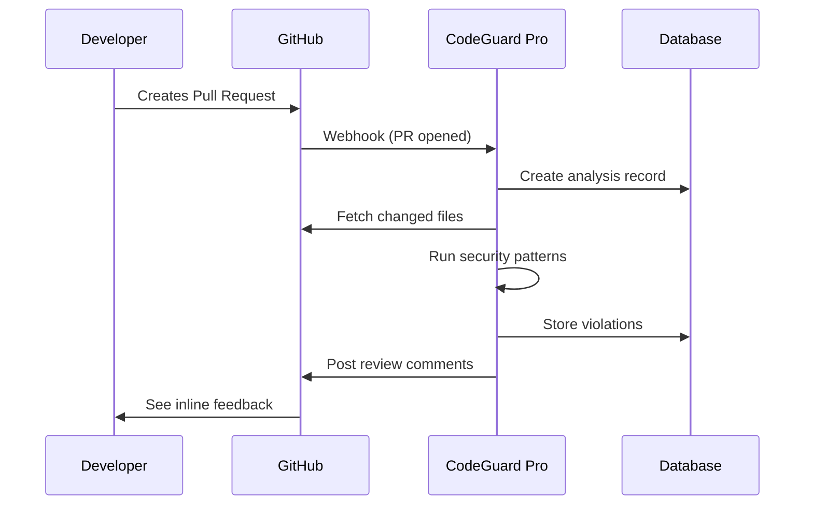

<p align="center">
  
  
  
  
</p>

# 🛡️ CodeGuard Pro

> **Automated Code Compliance & Security Analysis Platform for GitHub Pull Requests**

CodeGuard Pro is a full-stack **GitHub App** that automatically scans pull requests for security vulnerabilities and code compliance issues, providing real-time feedback directly on PRs through inline comments.

<div align="center">


</div>

---

## 📋 Table of Contents

- [Project Completion Status](#-project-completion-status)
- [Problem Statement](#-problem-statement)
- [Solution](#-solution)
- [Key Features](#-key-features)
- [Implemented Features Breakdown](#-implemented-features-breakdown)
- [System Architecture](#-system-architecture)
- [Tech Stack](#-tech-stack)
- [Project Structure](#-project-structure)
- [Installation](#-installation)
- [How It Works](#-how-it-works)
- [API Endpoints](#-api-endpoints)
- [Development Status](#-development-status)
- [Future Enhancements](#-future-enhancements)

---

## 📊 Project Completion Status

### Overall Progress: **85% Complete** ✅

| Category | Status | Completion |
|----------|--------|-----------|
| **Core Infrastructure** | ✅ Complete | 95% |
| **Analysis Engine** | ✅ Complete | 90% |
| **Web Dashboard** | ✅ Complete | 85% |
| **API Endpoints** | ✅ Complete | 90% |
| **Security Features** | ✅ Complete | 85% |
| **Advanced Features** | ✅ Complete | 80% |
| **Testing** | 🔄 In Progress | 50% |
| **Documentation** | 🔄 In Progress | 60% |
| **Production Deployment** | ⏳ Planned | 40% |

---

## ✅ Implemented Features Breakdown

### 🏗️ Core Infrastructure (95% Complete)

- ✅ **GitHub App Integration**
  - OAuth authentication via NextAuth.js
  - Webhook signature verification (HMAC-SHA256)
  - Installation token management
  - App installation tracking

- ✅ **Database (Prisma + PostgreSQL)**
  - User authentication with roles (ADMIN, DEVELOPER)
  - Team and team member management
  - Project and repository tracking
  - Rule definitions with language support
  - Analysis logs with violation details

- ✅ **Authentication & Security**
  - GitHub OAuth login
  - Session-based authentication
  - Protected API routes
  - Role-based access control

### 🔍 Analysis Engine (90% Complete)

- ✅ **Tree-sitter AST Analysis** (WASM-based)
  - JavaScript/TypeScript support
  - Python support
  - Java support
  - Go, C, Rust, and extensible language support
  - Grammar loader with lazy loading
  - Query compilation and execution

- ✅ **Built-in Security Rules**
  - Hardcoded secrets detection (API keys, passwords, tokens)
  - Weak cryptography detection (MD5, SHA1)
  - Code injection detection (eval, exec, document.write)
  - SSL certificate verification checks
  - Python pickle deserialization vulnerabilities
  - Customizable rule creation

- ✅ **Analysis Pipeline**
  - Fetch changed files from PR
  - Filter by supported languages
  - Execute security rules against code
  - Generate violation reports
  - Store results in database

### 💻 Web Dashboard (85% Complete)

- ✅ **Dashboard Pages**
  - Main dashboard with project overview
  - Projects management (CRUD)
  - Rules editor with templates
  - Analysis history and results
  - GitHub integrations page
  - Repository healing interface
  - User settings page

- ✅ **UI Components**
  - Responsive design with Tailwind CSS
  - Project cards with status indicators
  - Rule configuration forms
  - Violation details view
  - Activity feeds

- ✅ **Data Visualization**
  - Dashboard statistics API
  - Analysis history tracking
  - Violation counts by severity
  - Project health indicators

### 🔌 API Endpoints (90% Complete)

- ✅ **Authentication API** (`/api/auth/`)
  - GitHub OAuth flow
  - Session management

- ✅ **Projects API** (`/api/projects/`)
  - GET all projects
  - POST create project
  - DELETE remove project
  - Repository syncing

- ✅ **Rules API** (`/api/rules/`)
  - GET rules for project
  - POST create new rule
  - PUT update rule
  - DELETE remove rule
  - Rule templates endpoint
  - AI-powered rule generation

- ✅ **Analyses API** (`/api/analyses/`)
  - GET analysis history
  - POST new analysis
  - Violation details

- ✅ **GitHub Integration** (`/api/github/`)
  - Webhook receiver
  - Installation management
  - Sync repositories

- ✅ **Dashboard API** (`/api/dashboard/`)
  - Statistics and metrics

- ✅ **Repository Healing** (`/api/repo-heal/`)
  - Autonomous healing workflow
  - Result tracking

- ✅ **Notifications** (`/api/notifications/`)
  - Slack integration support
  - Analysis notification delivery

### 🚀 Advanced Features (80% Complete)

- ✅ **RepoHealerEngine**
  - Autonomous repository healing system
  - Test discovery and execution
  - AI-powered fix generation
  - Branch management
  - PR creation workflow

- ✅ **AI Integration**
  - LangGraph orchestrator for multi-agent workflows
  - AI bridge for violation explanations
  - Suggested fix generation
  - Rule explanation generation

- ✅ **External Integrations**
  - Jira ticket creation for critical violations
  - Slack notifications
  - GitHub sync

- ✅ **Background Processing**
  - BullMQ job queue setup
  - Worker system architecture
  - Rate limiting

- ✅ **Docker & Sandboxing**
  - Docker sandbox for code execution
  - Safe test execution environment

### 📚 Database & Utilities (Complete)

- ✅ **Database Seeders**
  - Seed all functionality
  - Rule seeding
  - Abstract rules setup
  - Language adapter configuration

- ✅ **Database Tools**
  - Check rules status
  - Query generator
  - Test detection

---

## 🎯 Problem Statement

Modern development teams face critical challenges:

- **Security vulnerabilities** slip through code reviews unnoticed
- **Hardcoded secrets** (API keys, passwords) accidentally get committed
- **Manual code reviews** are time-consuming and inconsistent
- **Compliance standards** are difficult to enforce across large teams

---

## 💡 Solution

CodeGuard Pro provides an **automated, real-time security analysis pipeline** that:

✅ Integrates seamlessly with GitHub via webhooks  
✅ Analyzes every pull request automatically  
✅ Detects security issues across multiple programming languages  
✅ Posts actionable feedback directly on the PR  
✅ Tracks compliance history through a web dashboard  

---

## ✨ Key Features

### 🔗 GitHub App Integration
- Receives webhooks on PR `opened`, `synchronize`, and `reopened` events
- Posts inline review comments on specific lines with violations
- Falls back to summary comments for better visibility

### 🌐 Multi-Language Support
- **JavaScript / TypeScript** - Node.js, React, Next.js projects
- **Python** - Django, Flask, FastAPI applications
- **Java** - Spring Boot, Maven projects
- Support for additional languages via extensible rule engine

### 🔍 Security Violation Detection
| Category | Detection |
|----------|-----------|
| **Secrets** | Hardcoded API keys, passwords, tokens, credentials |
| **Cryptography** | Weak algorithms (MD5, SHA1), insecure random |
| **Injection** | eval(), exec(), document.write() usage |
| **Configuration** | SSL verification disabled, insecure settings |
| **Python-Specific** | Pickle deserialization vulnerabilities |

### 📊 Web Dashboard
- **Projects View** - Manage connected repositories
- **Rules Management** - Create, edit, and toggle compliance rules
- **Analysis History** - Track all PR scans with detailed results
- **Rule Templates** - Pre-built security rule sets

### 🔐 Authentication & Security
- GitHub OAuth integration via NextAuth.js
- Webhook signature verification (HMAC-SHA256)
- Protected API routes with session management

---

## 🏗️ System Architecture

```
┌─────────────────────────────────────────────────────────────────┐
│                        GITHUB                                    │
│  ┌─────────┐    Webhook     ┌─────────────────────────────────┐ │
│  │   PR    │ ──────────────▶│         smee.io                 │ │
│  │ Created │                │    (Webhook Forwarding)         │ │
│  └─────────┘                └──────────────┬──────────────────┘ │
└────────────────────────────────────────────┼────────────────────┘
                                             │
                                             ▼
┌─────────────────────────────────────────────────────────────────┐
│                    CODEGUARD PRO SERVER                          │
│  ┌─────────────────────────────────────────────────────────────┐│
│  │                   Next.js API Routes                         ││
│  │  ┌──────────────┐  ┌──────────────┐  ┌──────────────┐       ││
│  │  │   Webhook    │  │   Projects   │  │    Rules     │       ││
│  │  │   Handler    │  │     API      │  │     API      │       ││
│  │  └──────┬───────┘  └──────────────┘  └──────────────┘       ││
│  │         │                                                    ││
│  │         ▼                                                    ││
│  │  ┌──────────────────────────────────────────────────────┐   ││
│  │  │              Inline Analysis Engine                   │   ││
│  │  │  • Fetch PR files via GitHub API                      │   ││
│  │  │  • Apply regex-based security patterns                │   ││
│  │  │  • Match against project rules                        │   ││
│  │  └──────────────────────────────────────────────────────┘   ││
│  └─────────────────────────────────────────────────────────────┘│
│                              │                                   │
│                              ▼                                   │
│  ┌─────────────────────────────────────────────────────────────┐│
│  │                    PostgreSQL (Supabase)                     ││
│  │   Users │ Projects │ Rules │ Analyses │ Violations          ││
│  └─────────────────────────────────────────────────────────────┘│
└─────────────────────────────────────────────────────────────────┘
                                             │
                                             ▼
┌─────────────────────────────────────────────────────────────────┐
│                        GITHUB                                    │
│  ┌─────────────────────────────────────────────────────────────┐│
│  │              PR Review Comments Posted                       ││
│  │   ⚠️ Line 42: Hardcoded API key detected                    ││
│  │   ⚠️ Line 78: Weak cryptography (MD5)                       ││
│  └─────────────────────────────────────────────────────────────┘│
└─────────────────────────────────────────────────────────────────┘
```

---

## 🛠️ Tech Stack

| Layer | Technology |
|-------|------------|
| **Frontend** | Next.js 14, React 18, Tailwind CSS |
| **Backend** | Next.js API Routes, Node.js |
| **Database** | PostgreSQL, Prisma ORM |
| **Authentication** | NextAuth.js, GitHub OAuth |
| **GitHub Integration** | Octokit, GitHub Apps API |
| **Deployment** | Vercel (Frontend), Supabase (Database) |

---

## 📁 Project Structure

```
codeguard-pro/
│
├── web/                          # Next.js 14 Application
│   ├── app/
│   │   ├── (auth)/              # Authentication pages
│   │   │   └── login/           # GitHub OAuth login
│   │   ├── (dashboard)/         # Protected dashboard routes
│   │   │   ├── dashboard/       # Main dashboard
│   │   │   ├── projects/        # Project management
│   │   │   ├── rules/           # Rule configuration
│   │   │   ├── history/         # Analysis history
│   │   │   └── settings/        # User settings
│   │   └── api/                 # API Routes
│   │       ├── github/
│   │       │   └── webhook/     # 🔥 Core webhook handler
│   │       ├── projects/        # CRUD operations
│   │       ├── rules/           # Rule management
│   │       └── analyses/        # Analysis data
│   ├── components/              # React components
│   └── middleware.js            # Route protection
│
├── database/                     # Database utilities
│   ├── schema.prisma            # Prisma schema definition
│   └── seed scripts             # Data seeding utilities
│
└── worker/                       # Background job worker (optional)
    └── src/
        ├── analysis/            # Analysis engine
        └── integrations/        # GitHub, JIRA integrations
```

---

## 🚀 Installation

### Prerequisites
- Node.js 18+
- PostgreSQL database (or Supabase account)
- GitHub App credentials

> 📘 **For detailed step-by-step setup instructions**, including how to create GitHub Apps, configure webhooks with Smee.io, and troubleshoot common issues, see the [SETUP.md](SETUP.md) guide.

### Quick Start

```bash
# 1. Clone the repository
git clone https://github.com/Harsha-codie/CodeGuard-Pro.git
cd CodeGuard-Pro

# 2. Install dependencies
cd web && npm install
cd ../database && npm install

# 3. Configure environment variables
cp web/.env.example web/.env
# Edit .env with your credentials

# 4. Setup database
cd database
npx prisma generate
npx prisma db push

# 5. Run the development server
cd ../web && npm run dev

# 6. Setup webhook forwarding (local development)
npx smee -u YOUR_SMEE_URL -t http://localhost:3000/api/github/webhook
```

---

## ⚙️ How It Works


```mermaid
sequenceDiagram
    participant Dev as Developer
    participant GH as GitHub
    participant CG as CodeGuard Pro
    participant DB as Database
    
    Dev->>GH: Creates Pull Request
    GH->>CG: Webhook (PR opened)
    CG->>DB: Create analysis record
    CG->>GH: Fetch changed files
    CG->>CG: Run security patterns
    CG->>DB: Store violations
    CG->>GH: Post review comments
    GH->>Dev: See inline feedback
```

1. **Developer creates a PR** on a connected repository
2. **GitHub sends webhook** to CodeGuard Pro
3. **Server fetches changed files** via GitHub API
4. **Analysis engine scans** each file for security patterns
5. **Violations are stored** in database for history
6. **Comments are posted** directly on the PR with line-specific feedback

---

## 📡 API Endpoints

| Method | Endpoint | Description |
|--------|----------|-------------|
| `POST` | `/api/github/webhook` | Receives GitHub webhooks |
| `GET` | `/api/projects` | List user's projects |
| `POST` | `/api/projects` | Add new project |
| `GET` | `/api/rules` | List rules for a project |
| `POST` | `/api/rules` | Create new rule |
| `GET` | `/api/analyses` | Get analysis history |
| `GET` | `/api/dashboard/stats` | Dashboard statistics |
| `GET` | `/api/rules/templates` | Pre-built rule templates |

---

## �️ Development Status

### Current Phase: **Core Implementation** ✅

The project is in the **core implementation phase** with most major features built and functional. Current focus is on:

#### ✅ Completed & Stable
- GitHub webhook integration and event handling
- Multi-language security analysis (JS/TS, Python, Java)
- Web dashboard with project/rule management
- Full REST API with CRUD operations
- Database schema and migrations
- Authentication and authorization

#### 🔄 In Progress
- Edge case error handling
- Component integration verification
- Real-time webhook processing optimization
- Performance testing and optimization

#### ⏳ Planned (Phase 2)
- Comprehensive test suite (unit, integration, e2e)
- Production deployment guide
- Advanced reporting and analytics
- Custom dashboard widgets
- CLI tool for local analysis
- GitHub Actions integration

### Testing Status

| Category | Status | Notes |
|----------|--------|-------|
| Unit Tests | 🔄 In Progress | Analysis engine tests partially complete |
| Integration Tests | ⏳ Planned | Database and API integration tests |
| E2E Tests | ⏳ Planned | Full workflow testing |
| Performance Tests | ⏳ Planned | Load testing and optimization |

### Known Limitations

1. **Local Development**: Uses Smee.io for webhook forwarding (not suitable for production)
2. **Tree-sitter Performance**: Large files (>10k lines) may take longer to analyze
3. **Concurrency**: Current setup supports sequential analysis; parallel processing planned
4. **Rate Limiting**: GitHub API rate limits apply; optimization in progress

### Deployment Readiness

- **Development**: ✅ Ready to use locally
- **Staging**: 🔄 Recommended with monitoring
- **Production**: ⏳ Additional hardening and monitoring needed

**Recommendations for production deployment:**
1. Configure proper GitHub App webhooks (not Smee.io)
2. Set up monitoring and error tracking (Sentry)
3. Implement proper log aggregation
4. Configure database backups and failover
5. Load testing before production

---

## 🔮 Planned Enhancements (Phase 2)

- [ ] **GitHub Commit Status API** - Block merging until issues fixed
- [ ] **Slack/Email Notifications** - Alert on critical violations
- [ ] **JIRA Integration** - Auto-create tickets for violations (partial)
- [ ] **AI-Powered Rules** - Generate rules using LLMs
- [ ] **Custom Rule Builder** - Visual rule creation interface
- [ ] **Team Analytics** - Violation trends and metrics
- [ ] **CLI Tool** - Run analysis locally before pushing
- [ ] **GitHub Actions Integration** - CodeGuard as a GitHub Action
- [ ] **Performance Dashboard** - Monitor analysis times
- [ ] **Rule Versioning** - Track rule changes over time

---

## 🚀 Contributing

Contributions are welcome! Areas where help is needed:

1. **Testing** - Write unit and integration tests
2. **Documentation** - Improve setup guides and API docs
3. **Rule Templates** - Create more security rule templates
4. **UI/UX** - Enhance dashboard design
5. **Performance** - Optimize analysis speed

---

## 👨‍💻 Author

**Harsha** - [GitHub](https://github.com/Harsha-codie)

---

## 📄 License

This project is licensed under the MIT License.

---

<p align="center">
  <b>Built with ❤️ for secure, compliant code</b>
</p>
